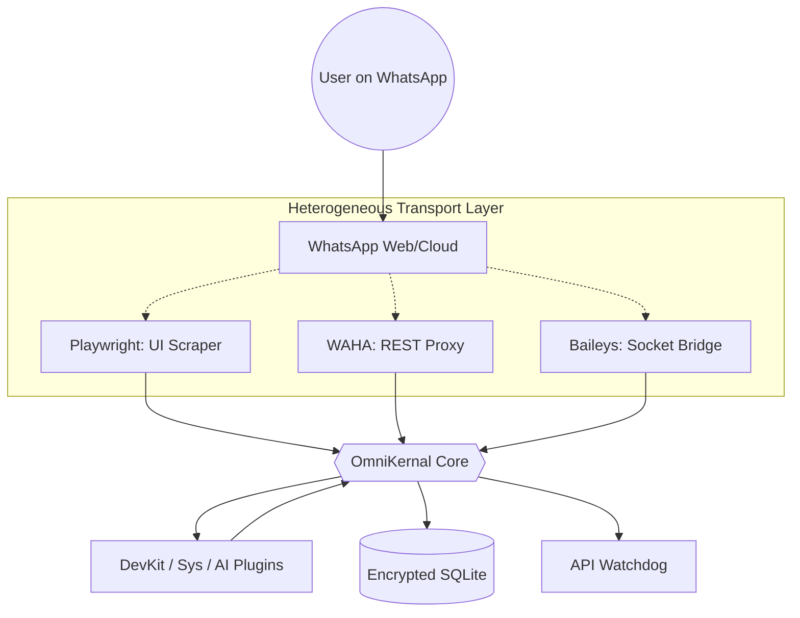

# Research Paper Prospectus: OmniKernal
**Title:** OmniKernal: A Microkernel Approach to Transport-Agnostic Agent Orchestration and Performance Heterogeneity

---

## 1. Abstract
As LLM-driven agents transition from sandboxed prompts to real-world interaction, the middleware used to connect agents to communication platforms (e.g., WhatsApp, Discord) has become a bottleneck. Current solutions are tightly coupled to specific SDKs. This paper introduces **OmniKernal**, a security-first microkernel that abstracts platform transport into interchangeable "Adapter Packs." We present a comparative study across three distinct transport layers: **UI-Scraping (Playwright)**, **REST-Proxying (WAHA)**, and **Native Socket-Bridges (Baileys)**. Our findings quantify the trade-offs between semantic fidelity, latency, and resource footprint, providing a roadmap for high-scale autonomous agent deployments.

---

## 2. Theoretical Framework: The Microkernel Bot
OmniKernal applies the classic **Operating System Microkernel** philosophy to bot architecture.

### A. Core Invariants
- **Transport Agnosticism:** The core system (`src/core`) contains zero platform-specific code. Interaction is governed by a strict abstract contract (**PlatformAdapter ABC**).
- **Execution Isolation:** Handlers are lazy-loaded and executed with a **CommandContext** that provides a "capabilities-based" surface (e.g., access to specific encrypted API keys without access to the full DB or the adapter).
- **Failure Resilience:** Implements an **API Watchdog** that monitors adapter health via a moving-window failure count, automatically quarantining problematic transport endpoints (Circuit Breaker pattern).

---

## 3. System Architecture & Transport Interaction
To evaluate transport heterogeneity, OmniKernal decouples the orchestrator (Microkernel) from the communication medium (Adapters). The diagram below illustrates the hierarchical interaction between the User, the heterogeneous transport layers, and the core processing engine.

### A. The Decoupled Request Cycle
The interaction flow differs significantly based on the chosen adapter. While the **Core** remains agnostic, the **Latency Gap** discovered in Section 4 is a result of these distinct data paths:

1. **Native Path (Baileys)**: Direct WebSocket connection $\rightarrow$ Protobuf Binary $\rightarrow$ Python.
2. **Proxy Path (WAHA)**: Docker Middleware $\rightarrow$ REST API $\rightarrow$ Python.
3. **Scraper Path (Playwright)**: Chromium Render $\rightarrow$ DOM Tree $\rightarrow$ Scraper $\rightarrow$ Python.

---

## 4. The Transport Research Matrix (The "Meat" of the Paper)
The primary research value of OmniKernal lies in measuring the performance delta between the three implemented adapters.

| Research Parameter | UI-Based (Playwright) | API-Based (WAHA) | Socket-Based (Baileys) |
|---|---|---|---|
| **Mechanism** | DOM Manipulation / Scraped | HTTP REST / Proxy | WebSocket / Protobuf |
| **Boot Time** | ~4.3s | ~4.1s | **~3.0s** |
| **RAM Usage** | ~532MB | ~817MB (Docker-heavy) | **~169MB** |
| **Mean Latency ($L$)** | ~40,361ms | **~10.4ms** | ~11.8ms |
| **Jitter ($\sigma$)** | ~39.3ms | **~4.5ms (Stable)** | ~11.4ms |
| **Deployment Weight** | ~250MB (Chromium) | ~850MB (Container) | **~20MB (Native JS)** |
| **Implementation Complexity**| 248 LoC | 400 LoC | 291 LoC |
| **Protocol Efficiency** | Low (HTML/Scraped) | Medium (JSON/REST) | **High (Binary Protobuf)** |
| **Reliability** | Low (DOM-fragile) | **High (Stateless)** | Medium (Stateful) |
| **Detectability (Ban Risk)**| **Extremely Low (Human-like)** | Medium | High (If bot tokens flagged) |

### Key Hypothesis for Analysis:
*   **The Latency-Complexity Trade-off:** Socket-based bridges (Baileys) offer near-instant response times critical for low-latency LLM stream-to-speech tasks, but increase maintenance complexity due to aggressive authentication token rotation.
*   **Resource Exhaustion in Scaling:** In multi-profile environments, UI-based scraping is computationally unsustainable, justifying the need for the **ProfileManager's** "Headless Enforcement" logic.

---

## 5. System Implementation & Design Patterns
*   **Security Layer:** Uses **Fernet symmetric encryption** for all sensitive session data at rest. Master keys are piped through environment variables (`OMNIKERNAL_SECRET_KEY`), ensuring the DB contains no readable secrets if compromised.
*   **Command Sanitization:** Implements an allowlist-based **CommandSanitizer** to prevent shell injection and RCE via LLM-generated text.
*   **Resiliency (Watchdog/Quarantine):** The system tracks consecutive failures per Tool/API. Upon exceeding the threshold ($\tau=3$), the system persists a `DeadApi` record, preventing further core-exhaustion by bypassing failed handlers.

---

## 6. Benchmarking Methodology & KPIs
To ensure academic rigor, OmniKernal's performance is evaluated using a dedicated automated harness (`benchmarks/harness.py`). We define four Key Performance Indicators (KPIs):

| KPI | Operational Definition | Research Value |
|---|---|---|
| **End-to-End Latency ($L_{e2e}$)** | $T_{reply\_sent} - T_{msg\_rcvd}$ | Measures system responsiveness for interactive AI. |
| **Resource Footprint ($R_{rss}$)** | Peak RSS Memory usage (MB) | Evaluates cost-efficiency of the orchestration layer. |
| **Throughput ($\Phi$)** | Messages processed per second ($msg/s$) | Defines the upper scaling limit of the microkernel. |
| **Jitter ($\sigma_L$)** | Standard deviation of latency | Indicates system stability and predictable behavior. |

---

## 7. Experimental Design
Our evaluation suite consists of three specialized test scenarios:

### A. Sequential Latency Stress-Test
Injects 100 sequential commands (`!devkit_ping`) to calculate the baseline overhead and the impact of the **EncryptionEngine** (Metadata decryption) on every turn.

### B. Burst (Concurrency) Load Test
Injects a burst of 50 simultaneous messages. This measures the efficacy of the **SelfMode** polling loop vs. the **Asyncio Task Management** overhead when multiple profiles are active.

### C. MTBF & Stability Analysis (Long-Running)
A 24-hour soak test designed to observe the "Conflict Rate" of the socket-based bridge (Baileys) vs. the API-based proxy (WAHA). This quantifies the **Mean Time Between Failures (MTBF)** and the success rate of the **ApiWatchdog's** auto-quarantining logic.

### D. Semantic Fidelity Analysis
A qualitative assessment of how different transports handle non-textual data (Emojis, Mentions, Media). This addresses the "Scraping Loss" phenomenon where UI-based scrapers (Playwright) may fail to accurately parse complex Unicode or mention JIDs.

---

## 8. Significance of the Project
OmniKernal demonstrates that by decoupling the **Platform SDK** from the **Agent Logic**, we can achieve:
1.  **Platform Portability:** Writing a plugin once and running it on WhatsApp, Discord, or Console without modification.
2.  **Architectural Resilience:** Survival of the system core even during volatile adapter disconnects via the "Circuit Breaker" pattern.
3.  **Informed Decision Making:** Providing data-backed guidance on which transport layer to use for specific agentic use-cases (e.g., Baileys for speed, Playwright for safety).

---

## 9. Future Work & Scalability Roadmap
While OmniKernal successfully demonstrates transport abstraction, several architectural limitations represent rich opportunities for future research:

1.  **Orchestrator Multi-Tenancy:** The current implementation is optimized for single-instance adapter execution per profile. Future work will evolve the microkernel to support **Simultaneous Multi-Transport Orchestration**, allowing a single kernel instance to manage message injection across WhatsApp (Playwright), Discord (Socket), and Slack (API) concurrently.
2.  **Dynamic Transport Switching (DTS):** Developing an AI-driven heuristic that automatically switches transport layers based on real-time health metrics. For example, if a high-speed Socket bridge (Baileys) is flagged for "Spam Risk" by a platform, the kernel could dynamically migrate the session to a UI-Scraper (Playwright) to mimic human behavior and evade detection.
3.  **Cross-Kernel Federation:** Exploring decentralized orchestration where multiple OmniKernal nodes share a global encrypted state, allowing agents to persist their "memory" even if the local transport node is compromised or rotated.
4.  **Zero-Knowledge Hardware Integration:** Migrating the **EncryptionEngine** to Trusted Execution Environments (TEEs) to ensure master keys never touch the host OS memory, providing ultimate security for agentic financial transactions.

---
**Keywords:** Agentic Workflows, Microkernel Architecture, Transport Heterogeneity, WhatsApp Automation, Resilience Engineering, Benchmarking, Performance Optimization.
